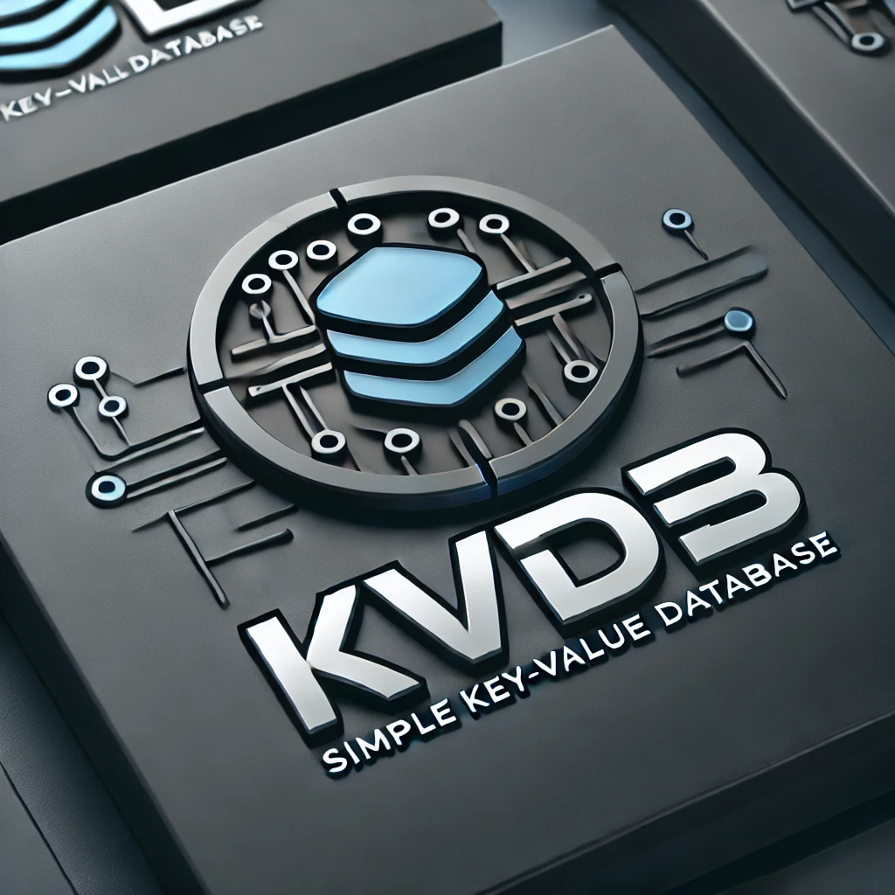

# KVDB - A Simple Key-Value Database

  

**KVDB** is a lightweight and key-value store built for learning and experimentation. 
It’s not meant for production.

## Goals
- Simple key-value store
- Lightweight and fast
- Basic CRUD operations (Create, Read, Update, Delete)
- Educational project for learning database structures

## TODO
- [x] Have fun 🎉
- [ ] Tests
- [ ] Basic CRUD
- [ ] Bloom Filter
- [ ] Merging/Compaction
- [ ] WAL
- [ ] REST API
- [ ] Type support
- [ ] Docker

## Getting Started

## Contributing
Feel free to fork this project and contribute! Open a pull request with improvements, bug fixes, or new features.

---
🚀 **KVDB** – Because every fun project starts with a simple key-value store!

